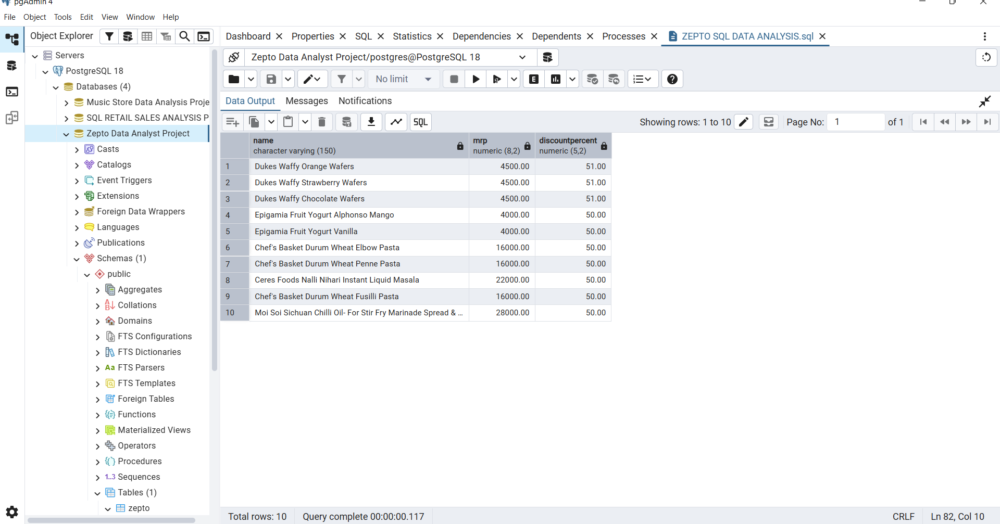
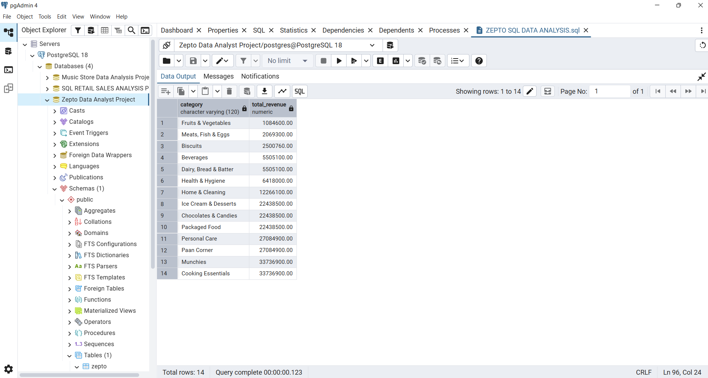
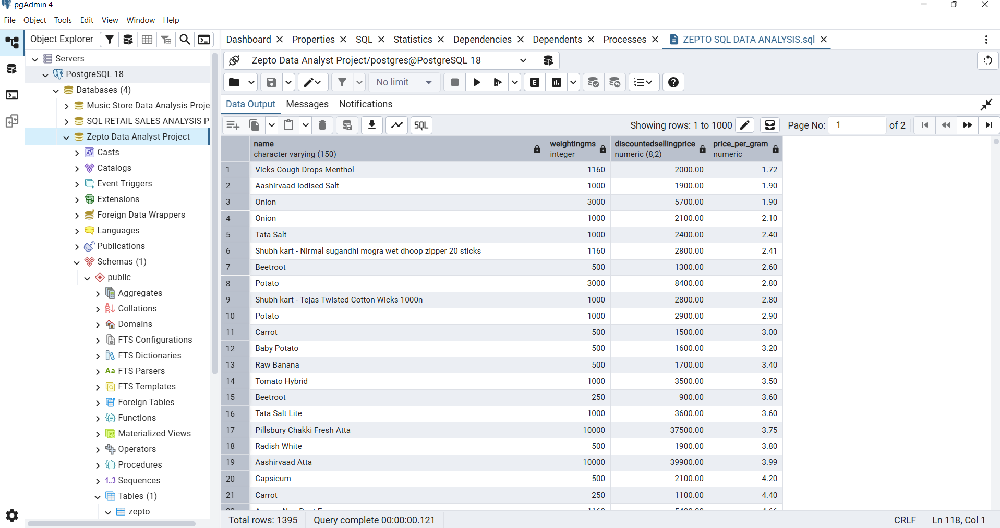

🛒 ZEPTO DATA ANALYSIS PROJECT (SQL)
📌 Project Overview

This project focuses on analyzing Zepto e-commerce product data using SQL to derive meaningful business insights.
The analysis answers key questions related to discounts, revenue estimation, product value, and category-level performance.

This project demonstrates my ability to work with real-world datasets, write optimized SQL queries, and convert raw data into actionable insights.

🎯 Objectives

Identify best-value products based on discount percentage

Estimate revenue contribution by product category

Analyze product value using price-per-gram metrics

Understand pricing and discount strategies across categories

🗂 Dataset Information

File Name: zepto_v2.csv

Description: Product-level data from Zepto (online grocery delivery platform)

Key Columns:

name – Product name

category – Product category

mrp – Maximum Retail Price

discountPercent – Discount offered

discountedSellingPrice – Final selling price

availableQuantity – Inventory quantity

weightInGms – Product weight

outOfStock – Stock availability

🛠 Tools & Technologies Used

SQL (Data querying & analysis)

MySQL / SQL Workbench

Excel (Dataset preview)

GitHub (Version control & portfolio)

❓ Business Questions Answered

Which are the top 10 best-value products based on discount percentage?

Which product categories contribute the highest estimated revenue?

Which products offer the best value based on price per gram?

Which categories provide the highest average discounts?

📊 Final Insights (Key Results)
### 📌 Top 10 Best-Value Products

### 📌 Estimated Revenue by Category

### 📌 Best Value Products by Price per Gram

Identified the top 10 products offering the highest discounts, helping understand aggressive pricing strategies.

Estimated total revenue by category, highlighting high-performing product segments.

Analyzed price per gram to determine products offering the best value to customers.

Found categories with the highest average discount percentages, useful for promotional planning.

📸 Project Screenshots
Dataset Preview

SQL Query Example

Query Output

These screenshots show the dataset structure, SQL logic, and resulting outputs for transparency and reproducibility.

📁 Repository Structure
ZEPTO-DATA-ANALYSIS-PROJECT
│
├── zepto_v2.csv
├── ZEPTO SQL DATA ANALYSIS.sql
├── dataset_preview.PNG
├── query_code.PNG
├── query_output.PNG
└── README.md
🚀 How to Run This Project

Download the dataset zepto_v2.csv

Import it into your SQL database

Open ZEPTO SQL DATA ANALYSIS.sql

Execute queries one by one to reproduce results

📌 Key Learnings

Writing optimized SQL queries

Using aggregate functions and grouping

Applying business logic to real-world datasets

Converting raw data into insights

👤 Author

Shubh Srivastava
MSc Statistics | Aspiring Data Analyst
🔗 GitHub: https://github.com/shubh200405-coder

🏷 Topics

sql data-analysis analytics ecommerce portfolio-project zepto
